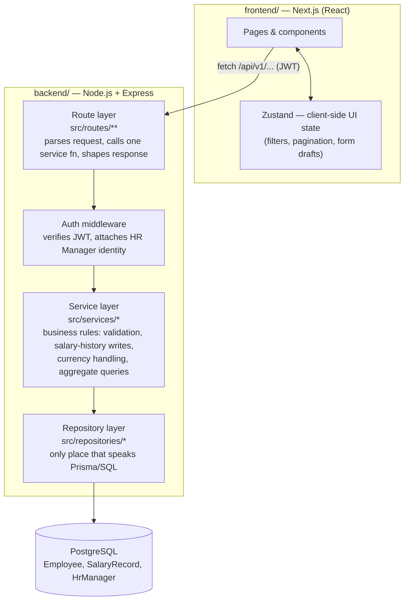
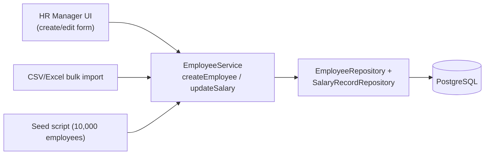
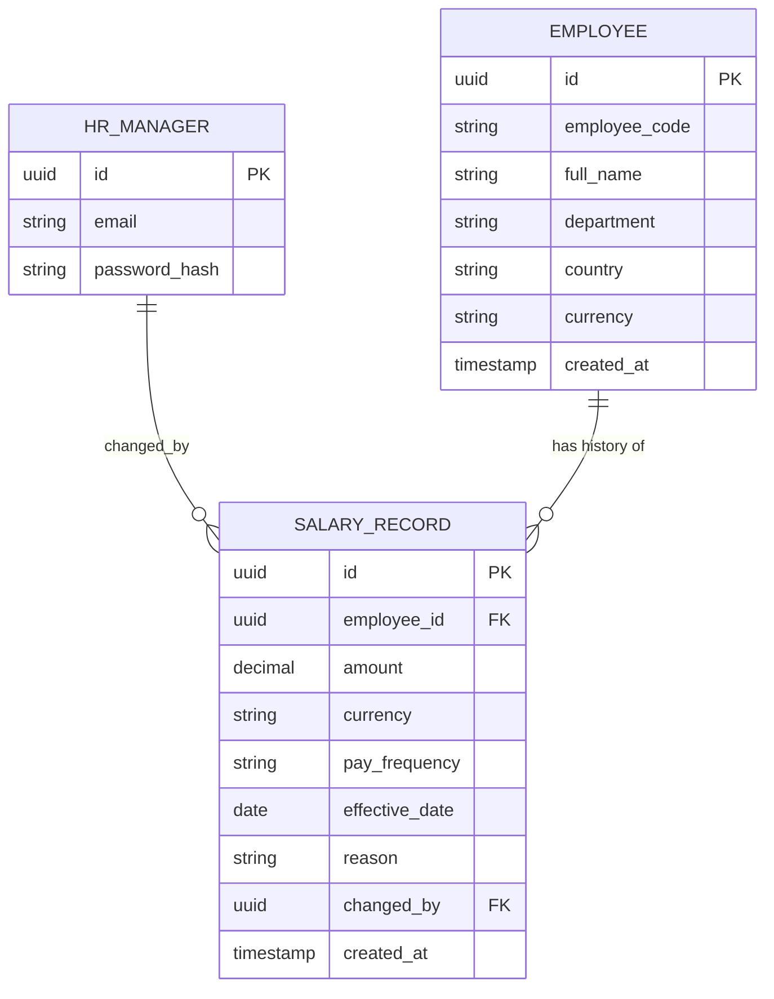
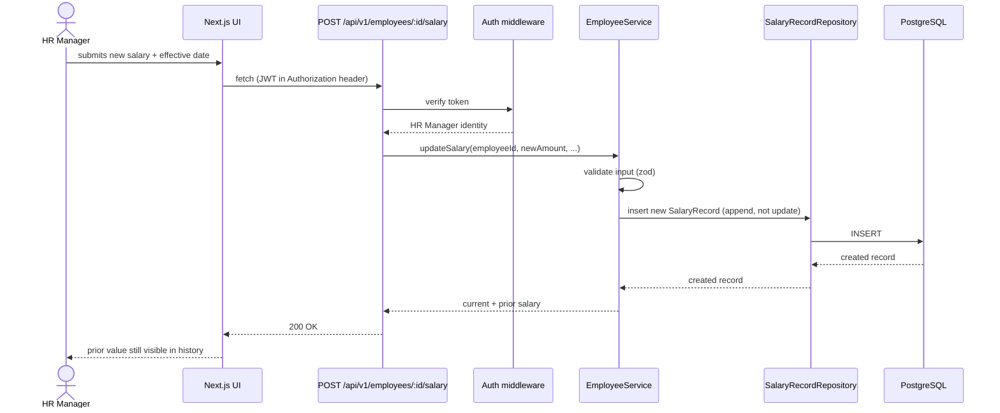

# Architecture

Phase 1 of the Employee Salary Management System (see [`REQUIREMENTS.pdf`](./REQUIREMENTS.pdf)).
This document explains *how* the codebase is organized and *why*, so the
reasoning survives past the first commit.

## Guiding constraint

The requirements are explicit that this is phase 1 of a longer roadmap
(payroll, self-service, RBAC, live FX). The architecture is optimized so
those phases can be **added**, not **retrofitted**. Every decision below
traces back to a specific future need — see [Built for Phase 2](#built-for-phase-2).

## Two deployables, one repo

The backend (REST API) and frontend (UI) are separate npm workspaces with
their own `package.json`, so each can be built, tested, and deployed
independently — the frontend never reaches into backend internals, it only
talks to `/api/v1/...` over HTTP.



**Why this split pays off at 10,000+ employees and beyond:**

- Route handlers stay thin (parse input, call a service, return a response) —
  they're the one thing that changes when a new transport is added (e.g. a
  payroll job calling services directly, no HTTP involved).
- Business rules (e.g. "an update creates a new `SalaryRecord`, never
  overwrites one") live in **one place** — the service layer — regardless of
  whether the caller is the manual CRUD UI, the CSV bulk-import path, or the
  seed script. This is the "one write path" requirement.
- The repository layer is the only code that imports Prisma. Swapping in
  read replicas for reporting queries, or adding caching, touches this layer
  only.
- Backend and frontend scale and deploy independently — the API can sit
  behind a load balancer with multiple stateless instances while the
  frontend is served separately (e.g. as a static/edge build).

## One write path for employees

Manual CRUD, bulk CSV import, and the seed script are three different
**entry points** that all funnel into the same `EmployeeService` functions,
so validation and history-writing logic is never duplicated:



## Data model (append-only salary history)

Salary changes are never overwritten. Every change — including the very
first salary an employee is hired at — is a row in `salary_records`. The
"current" salary is just the latest row per employee, not a separate
mutable field.



- `(amount, currency)` is stored together and never converted destructively —
  a currency change is its own `SalaryRecord` (`reason: CURRENCY_CHANGE`).
- `changed_by` + `created_at` on every row makes the history table double as
  the audit log — no separate audit system needed.
- Department and country are plain fields (flat list), not normalized into
  separate tables — there's no hierarchy to model in phase 1.

## Request flow example: HR Manager updates a salary



## Built for Phase 2

Each item below is a concrete hook already implied by the structure above,
not a promise to design for later:

| Concern | How phase 1 stays open to it |
|---|---|
| Payroll job / self-service API as a new consumer | Reuses the same service-layer functions; nothing to duplicate |
| Live FX conversion | `(amount, currency)` kept intact; conversion isolated behind one function to swap later |
| Multi-role RBAC (`EMPLOYEE`, `ADMIN`, ...) | Auth middleware centralizes the check; adding a role is additive, not a rewrite |
| Payroll/notification "subscribing" to salary changes | Append-only `salary_records` is already the event log |
| Breaking API changes later | Routes live under `/api/v1/...` from day one |
| Scaling traffic | Stateless JWT auth, no server-side session — scale by adding instances, not code |
| Future NL/chatbot reporting layer | Aggregate queries live in the service layer as reusable functions, not baked into a UI component |

## Tech stack

| Layer | Choice | Why |
|---|---|---|
| Backend runtime | Node.js + Express | Small, well-understood REST framework; keeps the route layer thin on purpose |
| Frontend framework | Next.js (App Router) | Mature React setup with file-based routing; renders the dashboard/reporting UI |
| Language | TypeScript (both workspaces) | Shared discipline between API and UI; catches data-shape mistakes at 10k-record scale before runtime |
| Database | PostgreSQL | Relational integrity for append-only history; indexed queries for pagination and aggregates at scale |
| ORM | Prisma | Typed queries, migrations, and a schema file that doubles as living documentation of the data model |
| Client state | Zustand | Small, unopinionated store for UI-only state (filters, pagination) — no global state framework needed for an HR-manager-only app |
| Styling | Tailwind CSS | Utility classes keep styling co-located with markup; no separate CSS architecture to maintain |
| Auth | JWT (stateless) | Matches the "stateless API" non-functional requirement directly |
| Validation | Zod | Runtime validation at the service boundary, sharing the same schema shapes as TypeScript types |
| Tests | Vitest | Fast, TypeScript-native test runner for services/repositories |

## Directory layout

```
employee-salary-management/
  docs/                  REQUIREMENTS.pdf, ARCHITECTURE.md
  backend/
    src/
      domain/            Plain types/entities shared across services
      services/          Business logic — the one write path lives here
      repositories/       All Prisma/SQL queries
      routes/             Express route handlers (/api/v1/**)
      __tests__/          Service & repository tests
    prisma/
      schema.prisma       Data model
    scripts/
      seed.ts              Deterministic 10,000-employee seed
  frontend/
    src/
      app/                 Next.js routes/pages
      store/               Zustand stores (client-side UI state only)
  package.json             npm workspaces root (shared scripts only)
```

Folders are filled in as the feature that needs them is built, rather than
scaffolded with placeholder code ahead of time.
